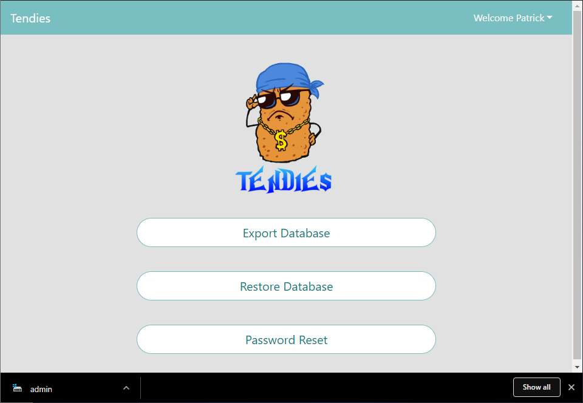

# Sprint 4: Jr. Developer

1. Accomplishments 
2. Comments 
3. Trello Card(s)
4. Commit(s)

#### 1. Encrypt databases with OpenSSL & MYSQL  

* Removed plain text passwords

*Before*  
The original script that input the 15 test users into the database used plain text for the passwords, which were also stored in 
the database in the same manner. This is a huge security issue, but allowed us to initiate the database with users that could be 
accessed by other members working on other portions of the project.  

*After*  
Now the passwords are hashed using SHA256 to be used in the database creation script to prevent plain text passwords at creation. 
For each user their hash is then used with a random salt to create a SHA256 hash that is used in the database password field 
“pass.” The salt is also recorded in the field “salt” to be used for verification purposes later.  

* Data-in-use encryption for the databases  
Enabled the keyring plugin for MYSQL to encrypt the database files that are in use. This will only allow valid users logged 
into MYSQL to access the information in the Users table. That is the only table with sensitive information.  

* Data-at-rest using OpenSSL  
OpenSSL will be used when sql dumps are made of the databases, either to archive them or for export/import purposes. This will 
be be implemented when the export and import feature are added to the admin portion of the web app. A passphrase will be used 
at the time of export to encrypt the sql file so it can be used on another machine if needed. 

1. Comments:  

Started by converting all plain text passwords to SHA-256 hashes. We then combined that hash with a salt to create a new SHA-256 
hash to create another layer of separation and security between the plain text and what is stored in our database. I was working 
with Matt, Ian, and Raiven to help integrate it into our app. I can’t remember who, but someone pointed out that the salts were 
all the same with my first iteration of the code. I thought using the <code>RAND</code> function with the current timestamp in 
milliseconds would work. Unfortunately, the code worked to quickly and most of the salts used the same timestamp. I swapped the 
timestamp variable with the Universally Unique Identifier (UUID) for creating a salt. This solved our randomization problem with
the salts. 

Next, we added encryption-in-use by using the built in MySQL <code>keyring</code> encryption method. This was performed by 
enabling the <code>keyring_file.so</code> plugin in the post install script for the databases. Then added the 
<code>ENCRYPTION</code> option when creating the database with MySQL. 

2. Trello Card:  

3. Github Commit Link(s): 
hashed passwords -  https://github.com/illinoistech-itm/2019-team-03r/commit/f36841aab1e31b204a510227bd758a3228c41209
Data-in-use - https://github.com/illinoistech-itm/2019-team-03r/commit/ca88ff21d0cebac76d9586da6393b0eb87aacb94

#### 2.  Load correct web page view based on privileges/registration status

*Milestones:*  
*Can login with any credentials and web page will change accordingly- Completed
*Incorporate privileges based on user credentials- In Progress
*Allow for proper registration and use of those credentials to login- In Progress

1. Comments:  

Raiven, Ian, and I worked on getting the correct webpage to load based on whether or not the user as an admin. We changed 
some of the variable names, such as dropping an email for a username to an actual user name. Capabilities were added to the 
<code>login</code> function to tie the username to the session and add it to the webpage. The code was pushed to Matt for 
testing who then pushed it to the repo. 

2. Trello Card:  

3. Github Commit Link(s):  
Login Python-
https://github.com/illinoistech-itm/2019-team-03r/commit/b92a15bb7b2eb3c58cb7174fd7564110c0a80ab6#diff-b09cb984d0509837482be4c4f9e34eb2
HTML name changes-
https://github.com/illinoistech-itm/2019-team-03r/commit/86dc9be43a8195622256a67476c28d81ee9b1d78
Changing nav bar-
https://github.com/illinoistech-itm/2019-team-03r/commit/392fefb16ddf9e20a11e7c3dabc1a9533cc3a73a

#### 6. Continue to expand python/Flask/API use:  
*Milestones:*  
* Implement custom user settings (stars, distance, etc)- Completed
* Create a connection between the website and database- In Progress
* Incorporate functionality for the additional information about restaurant page (i.e. contact, most recent review, distance)- In Progress

1. Comments:  

Raiven, Ian, and I added accuracy to the app by improving our Yelp search functions. We accomplished this by transferring user inputs on the site into the calls to the Yelp API. We also created more stable default settings for if the user did not input any options. Ian pushed the final product out after testing it. 

2. Trello Card:  

3. Github Commit Link(s):  
Use user provided specifications for a more detailed restaurant 
https://github.com/illinoistech-itm/2019-team-03r/commit/de76a63b3a9c9924a96f203423cb8d80fda2a8f8

# Sprint 5: Jr. Developer  

1. Accomplishments 
2. Comments 
3. Trello Card(s)
4. Commit(s)

##### 2. Implement functionality on “Top Review” and “Try Again” buttons on the search results page  

Implement functionality on “Top Review” to take the user to the second part of the page showing a user review and 
another button to return without reloading the page.  “Try Again” buttons on the search results page to allow a user 
to try their luck again if the initially selected place is not somewhere they would like to go.

Comments:  

We changed API query results from being input directly to the webpage into session related variables. This allowed us to 
keep track of what the user had searched for so we didn’t duplicate results during the Try Again function. We could also 
have more versatility with how we presented those objects to the user. Matt did a quality check of the code before pushing it. 
Raiven completed the Top Review button, which allowed us to incorporate into a Yelp query.  

Trello Card:  

Commit Link(s):  

Try again implemented - https://github.com/illinoistech-itm/2019-team-03r/commit/16c68ec59a9b79e8d4d7d36d7ec9ec128a2a45ee

#### 3. Load correct web page view based on privileges/registration status

*Milestones:*  

* Incorporate privileges based on user credentials

Admin pages have different privileges and pages that they have access to. The page now properly displays button views based on 
whether you are logged in and certain views are restricted based on privilege to ensure Admins and normal users are separated.

*Normal user trying to go into admin page*  

*Admin user trying to go into admin page*  

Commit Link(s):
Load different button views based on if logged in or not - 
https://github.com/illinoistech-itm/2019-team-03r/commit/5588dd4106d18579c513e80eba2741e1a8896ca8
Restrict views based on privilege/login status - 
https://github.com/illinoistech-itm/2019-team-03r/commit/a4a28b091794ccba908f4963f76fb94be5afd8c9

* Allow for proper registration and use of those credentials to login 

Without a connection to the database, the ability to properly register a new account was not implemented at first. Now that there is a connection a user can register, have this data be a part of the database, and use these credentials to login whenever they need to.

*Before Registering*  

*Registering*  

*After Registering*  

  
  

Commit Link(s):  
Backend code : check user entered data, register it in the db if viable else return error - 
https://github.com/illinoistech-itm/2019-team-03r/commit/596de10ebd5c185f526dd8debe43f7a24656d392
Backend login code: make a call to the db to check user credentials, verify, and update login status - 
https://github.com/illinoistech-itm/2019-team-03r/commit/1922f85dfb17d78aa81241c208d60a44124648c9

Comments:  

Ian, Tim, and I had created a function to check the database for the privilege value associated with a user once they log in. 
If the user had a “1” then they were an admin and given access to the admin page. Standard users have a privilege value of “0” 
and are not allowed to access the admin page. When a user attempts to register, a query is performed on our database to see if 
that email already exists. If it does the user sees an error. If the email doesn’t exist, and they have entered the same password 
twice it creates an entry in the database through an <code>INSERT</code> command. With the user’s information now in the database, 
their credentials can be used to login in the future. We sent the code to Matt for testing and quality assurance before he pushed 
it to the repo.  

Trello Card:  

#### 4. Continue to expand python/Flask/API use

Our code was still incomplete when it came to the interaction between web server and database servers, lack of a proper 
additional information page, usage of user data, and proper functionality of options such as logging out. These 4 tasks were 
our main objective for the backend aspect in regards to Python, Flask, and API use. 

*Milestones:*  

* Create a connection between the website and database

We had created a database with tables and 15 test users for our database servers, but it was still incomplete since the website 
was not connected to it. For the sake of testing, we left it like this to allow the user to login with any credentials to 
demonstrate the process of logging in regardless of what username/passwords were in the tables. This has now been fixed to only 
allow users with registered username and passwords to be authenticated. Access control is also implemented based on login 
privileges: non-admin users cannot go to the admin page, the settings page is unavailable to users that are not logged in, 
and the signup/login page is unavailable to users that are logged in. In addition, this allowed us to show the logged in users 
different options then users not logged in.

*Incorrect Login Credentials:*  

*Correct Login Credentials:*  

*In Users table*  

Commit Link(s):
dbCon.py file handles database connections:  

Sign up functionality -  
https://github.com/illinoistech-itm/2019-team-03r/commit/596de10ebd5c185f526dd8debe43f7a24656d392
Login functionality - 
https://github.com/illinoistech-itm/2019-team-03r/commit/1922f85dfb17d78aa81241c208d60a44124648c9

* Incorporate functionality for the additional information about restaurant page (i.e. contact, most recent review, distance)

Decided to limit this page to showcasing a recent review from a user about their experience.

*Page 1*  

*Additional Info Page(Review)*  

Commit Link(s):

Additional info page - https://github.com/illinoistech-itm/2019-team-03r/commit/57587fa23b7fbc3c1f898995e480f57d95a1db9e

* Add user data and respond to session cookie 

Instead of passing data to web pages by including them in the URL, we moved the data to a session cookie. This improved 
functionality by: cleaning up the URL, cleaning up the code, and allowing the data to be accessed from multiple points on the 
webpage. The session can also hold more data.

Commit Link(s):

Adding data to cookie - https://github.com/illinoistech-itm/2019-team-03r/commit/16c68ec59a9b79e8d4d7d36d7ec9ec128a2a45ee

* Add logout functionality

For demonstration purposes, we had the logout function just simply lead to the home page but this has now been properly adjusted 
to actually log out the user after they are signed in.

*Logout button*  

*Logout confirmation*  

Commit Link(s):  

Logout function in tendies.py -  https://github.com/illinoistech-itm/2019-team-03r/commit/5f01612bbfc6f2f18dfef001fb50a35ee9cf85d2

Comments:  

As mentioned earlier, Tim, Ian, and I changed the Yelp query results to session variables. This allowed us to use them how we 
wanted and present them to the user in more ways, as well as session cookies. We created a <code>logout</code> function that ends 
the browser session and clears any of their ties to the app or system. We sent the code to Matt for further testing and quality 
checks before he pushed it. 

Trello Card:  

# Sprint 6: IT Operations

1. Accomplishments 
2. Comments 
3. Trello Card(s)
4. Commit(s)

#### 1. Implement Admin Powers

During the last sprint, we had set up an admin page that was only accessible to users that were set with admin privileges. The 
page has 3 buttons which were to export database, restore database, and reset passwords. Adding functionality to this page and 
the 3 buttons was a big focus on Sprint 6.

*Admin Page*  

*Milestones:*

##### Password Change

One ability that an administrator level user has is to change password. The button had existed on the admin page during Sprint 
5 but the functionality has now been implemented. 

*Users table before password change*  

*Inputting information for password change*  

*Password reset confirmation*  

*Users table after password reset (different password hash and salt)*  

Commit Link(s): 
https://github.com/illinoistech-itm/2019-team-03r/commit/1c43d80e8bb1435d62fbb5e58a569c968f23959f

##### Export DB

Another duty of the admin is to export a database for backup purposes or transferring to another database. A 
<code>mysqldump</code> of the tendiesdb database provides us with a sql file that contains all of the contents of the 
database, as well as commands needed to be imported into another database (CREATE TABLE, INSERT INTO TABLE, etc.). OpenSSL 
was used in conjunction with the dump command to create an encrypted file that is base64 encoded,  AES256 utilizing a salt 
and passphrase. Dumps are taken from the “read” slave database.

*Exported dump file downloaded as admin file*  

*Dump file is encrypted*  

Commit Link(s):  
https://github.com/illinoistech-itm/2019-team-03r/commit/d3c698f3252c7a2aaa804e35b75d346882f6e158
https://github.com/illinoistech-itm/2019-team-03r/commit/057c4c49e1db01567676682c57ed1f67568633b2

##### Import DB
The admin must also be able to import a backup database if something ever goes wrong with the live database. In the admin 
screen they have the option to choose a local file, most likely created from the export function, and upload it. The import 
function then decrypts the dump file and imports it into the “write” master database. 

*Import dump file*  

Commit Link(s):  
https://github.com/illinoistech-itm/2019-team-03r/commit/d3c698f3252c7a2aaa804e35b75d346882f6e158
https://github.com/illinoistech-itm/2019-team-03r/commit/0850038c916034711c3b724428748771d3b1b23e

Comments:  

Tim was having computer issues so Raiven and Akvile helped him with the UI duties. With not much to be done with IT Operations I assisted Matt with creating export and import functions of the database. Added mysql-client to the post install script of the web servers to be able to do a <code>mysqldump</code> of the database. It was either this or do a whole bunch of work creating users with limited privileges, setting up file sharing features to both the web and database servers, and adding firewall rules. This option allowed us to pull the correct data from the databases with pre-existing features, while also limiting capabilities of the user between the two types of servers. Additionally, <code>mysqldump</code> allows us to incorporate all of the additional MySQL commands needed to import the sql file into another database. No need to add complexity to a process that is already in place that fits our needs.

OpenSSL was used in conjunction with the <code>mysqldump</code> to create a sql file that was encrypted at rest with base64 encoded AES256, utilizing a salt and passphrase. The script also took an encrypted sql dump and imported it into a database. There was also a clean up function added to delete any remnants of sql dump files on the web server left after imports and exports. I pushed the script to the repo so Matt could implement it with flask and the website. 

Trello Card:  

