# Midterm Report

## ITMT 430 2019 - Christopher Steinberg

***Note:  Our team would often work together in the same room when working on the project. It was easier to have one person make the commits to to the repo during this time for convenience sake. For this reason the commits presented in this report may not have been pushed by myself, but does reflect the product that the report asks for. Until recently we had thought the reports were going to be a group effort, so our method didn’t appear to be an issue at the time.***

### Sprint 1: IT Ops

**1. Choose Project Idea**

We will design a food picker platform to pick where to go to eat when you can't decide. Since we have a limited timeline for this project, we'll limit the food options to the vicinity of IIT. 

*Trello Card:*
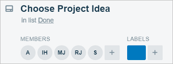
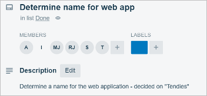

*Comments:*
We were having trouble with picking a place to eat lunch at the time we were deciding what our project should be. The two ideas merged, and we decided to kill two birds with one stone.

*Commit Link:* 
https://github.com/illinoistech-itm/2019-team-03r/commit/ee9ddefc5cc82219c3a276f0cee61bd22e8d274a

**5. Map out requirements**

We are considering using Linux for our OS, MySQL for the database, and Python, PHP, Apache/Tomcat/nginx for the backend. This decision is not finalized at this moment, but will be at the lunch hour today (2/7/19).

*Trello Card:*
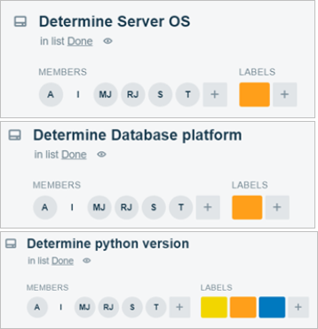

*Comments:*
We decided to go with platforms that we were familiar with and had used in other classes, as well as our personal endeavours.

*Commit Link:* 
https://github.com/illinoistech-itm/2019-team-03r/commit/32725437baeee07c40a26f886a96eaba30b1d555

**6. Preliminary Infrastructure Design**
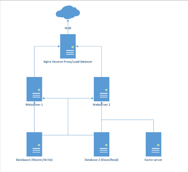

*Trello Card:*

*Comments:*
Ian and myself mapped out the infrastructure we wanted to use for the project. We wanted to keep it simple, but still meet the requirements. The proxy acts as the entry point to the internet and balancing the load between the two web servers. The web servers each communicate with the database servers to ensure all information is current. A master and slave database server for redundancy. Ian sent the diagram to Akvile so she could put the diagram on the sprint 1 report.

*Commit Link:* 
https://github.com/illinoistech-itm/2019-team-03r/commit/32725437baeee07c40a26f886a96eaba30b1d555

### Sprint 2: Project Manager

**1. Complete Sprint 2 Report**
*Trello Card:*
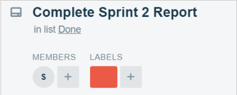

*Comments:*
I had Ian assist Tim with Ops, because his laptop was having issues running the deployment. Limited resources took a bigger toll on our progression than we thought it would. I finished up the report and sent it to Akvile. She already knew how the first report was supposed to look in markdown, and I didn’t want the report to look like a Frankenstein creation as the reports progressed. She edited the syntax of the report and committed it to the repo. 

*Commit Link:* 
https://github.com/illinoistech-itm/2019-team-03r/commit/cd066f3802901046d3ea9749dd68915f1e900c22

**2. Trello Comments and Organization**

*Trello Card:*
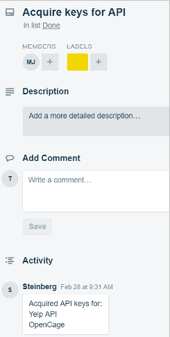

*Comments:*
I commented on this card just to keep track of what keys we acquired. As I became more familiar with Trello I also worked on organizing trello cards to include checklists, atomic goals, and archive the cards that were finished from last sprint.

*Commit Link:* 
We did not submit anything to the repo for this, so there is no related hash. .

### Sprint 3: Developer

**2. Finalize post-configuration scripts for each server**
*Milestones:*
1. Post-configuration script for masterdb completed: 
*masterdb-postinstall.sh*
- Creates a temporary directory to hold:
  - db.txt - the database password which is a 14 character randomly generated base64 encoded string
  - replica.txt - the replica user password which is a 14 character randomly generated base64 encoded string
  - tendiesdb.sql - mysql database dump file
- Sets the server timezone to CST
- Updates the base OS with latest security patches and packages
- Installs mysqlserver
- Copies the configuration files from the repository and restarts mysql after doing so
- Sets up both the root and replica users on mysql
  - Root user creates the database and creates the replica user which is a user account with the singular purpose of facilitating replication between the master and slave databases
- Root user exports the replication data that will be imported by the slave database
- Firewall is enabled
2. Post-configuration script for slavedb completed: 
*slavedb-postinstall.sh*
- Creates a temporary directory to hold:
  - db.txt - the database password which is a 14 character randomly generated base64 encoded string
  - replica.txt - the replica user password which is a 14 character randomly generated base64 encoded string
  - master.txt - log file to track the slave database replication
- Sets the server timezone to CST
- Updates the base OS with latest security patches and packages
- Installs mysqlserver
- Copies the configuration files from the repository and restarts mysql after doing so
- Sets up both the root and replica user on mysql
- Root user creates the database and imports it from the master
- Root user sets the master host and replica user as the master user of the slave database and restarts the slave database to begin replication
- Firewall is enabled
3. Post-configuration script for proxy completed: 
*proxy-postinstall.sh*
- Updates the base OS with latest security patches and packages
- Installs nginx
- Copy server files to the proper locations
- Firewall is enabled
- Copy certificate files to the proper location
- Restart nginx once the steps listed above are completed
- Post-configuration script for webs1 and webs2 completed
- webs-postinstall.sh
- Updates the base OS with latest security patches and packages
- Copy web files over from repository to the server
- Set up the Python environment and install the necessary addons
- Firewall is enabled
- Start web app service

*Trello Card:*
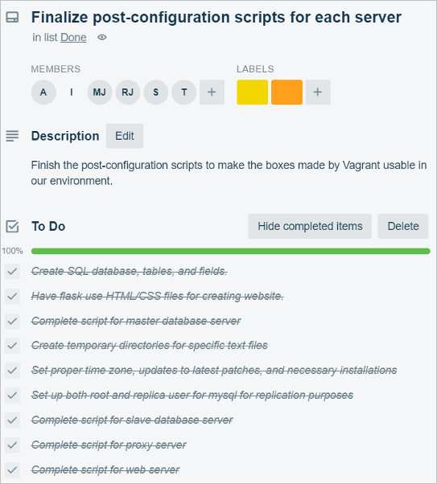

*Comments:*
The whole group got together to finalize the scripts and Ian pushed them out so we could perform post-testing. 

*Commit Link:*
https://github.com/illinoistech-itm/2019-team-03r/commit/7d5906beeec8f85a87fafcb67783a050df7c40d7

**3. Create a User and Preferences table for the database and fill it with sample test user data**

Changes from Sprint 2:
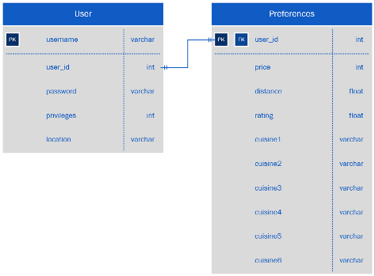

Before going over our tables, it is important to note the changes we made to the schema (see image above).
1. The Users table no longer has a field for location because we have no need to store a location for the user, especially if they are running the application from different locations every time.
2. After finding out how many cuisine types existed, we expanded from 6 to 15 cuisine types to accomodate to more user tastes.

Updated Database Schema:
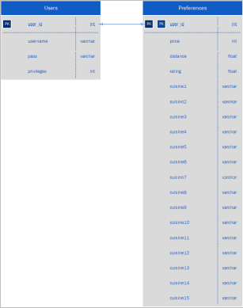

*Current Database Tables*
These were created through the tendiesdbtables.sql file.
A breakdown of the file is explained below:
**Users Table**
Fields (4)
- user_id (primary key)
- username
- pass
- priv

Reference Image
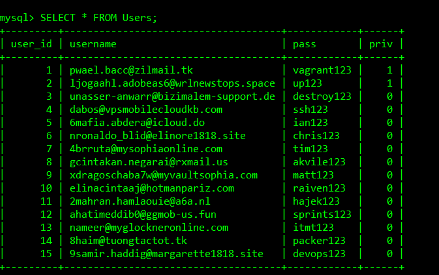

**Preferences Table**
Fields (19)
- price
- distance
- rating
- user_id (foreign key)
- cuisine types (15 kinds)

*Reference Image*
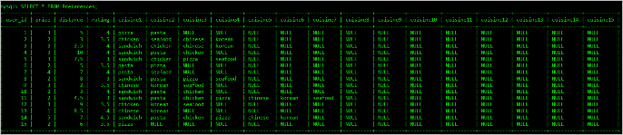

For both tables, the data types and proper lengths were taken into account to allow for multitude of possible answers (ex: extremely long emails). For testing purposes, 15 users (2 with admin level privileges (priv = 1) and 13 normal users (priv = 0)) were inserted within the SQL file along with their preferences so that both tables were filled with data that differed. Then, this file was imported into the masterdb-postinstall.sh script so that all of this can be automated (as explained in goal 2).
These are the following commands to test that the database is up with both the User and Preference tables and that it is populated:

1. vagrant up masterdb
2. vagrant ssh masterdb
3. sudo -i mysql
4. SHOW DATABASES; (to confirm tendiesdb is present)
5. USE tendiesdb;
6. SHOW TABLES; (to confirm that the two tables have been created)
7. *SELECT * FROM Preferences; (display all fields from Preferences table)
8. *SELECT * FROM Users; (display all fields from Users table)

*Resulting Image:*
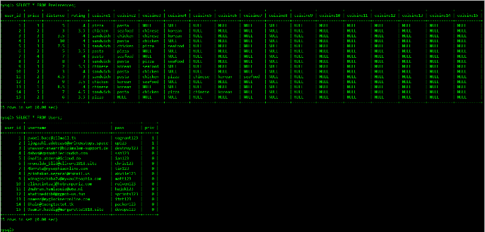

These are the following commands to test that the slave database copied the information that was written to the master database:

1. vagrant up slavedb
2. vagrant ssh slavedb
3. sudo -i mysql
4. SHOW DATABASES; (to confirm tendiesdb is present)
5. USE tendiesdb;
6. SHOW TABLES; (to confirm that the two tables have been created)
7. SELECT * FROM Preferences; (display all fields from Preferences table)
8. SELECT * FROM Users; (display all fields from Users table)

*Resulting Image:*
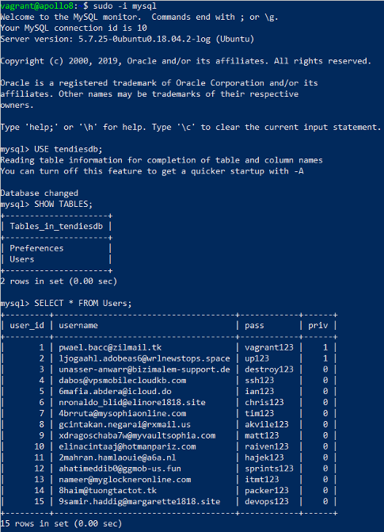

*Trello Card:*

*Comments:*
Tim and Ian swarmed to this since we were under under a bit of a time constraint. Tim was the one who committed the SQL file for the updated schema. Akvile and I continued testing the Python scripts. 

*Commit Link(s):*
MySQL file upload - https://github.com/illinoistech-itm/2019-team-03r/commit/004ea3aa4aada4d47df2a2b8cbea9c0079b53e0a

masterdb-postinstall.sh - https://github.com/illinoistech-itm/2019-team-03r/commit/e428ed91834c6701aaf3ea0e51b5bb23845fbc8c

**3. Begin testing Python scripts and tweaking them to work with our API’s**
Milestones:
Implement Flask framework with Python to:
- Display webpage through web server
- Retrieve user entered location
- Use OpenCage API to convert user location into latitude and longitude
- Search for local food business in the area, select one at random, and return more information about it including:
  - Name
  - Rating
  - Address
  - Price
  - Food Types
  - Images
- Re-display information on webpage

*Python Logical Flow Reference Diagram*
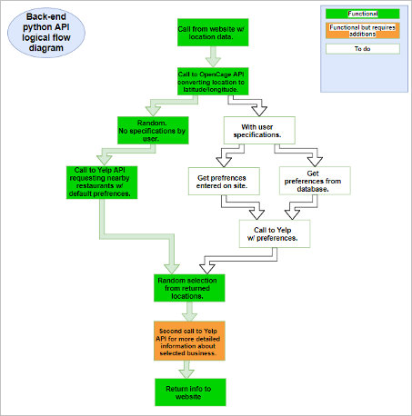

*Trello Card:*
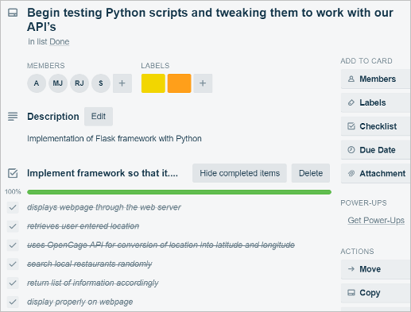

*Comments:*
Akvile and I were confident in the scripts, so we sent them to Matt and Raiven, who were working on Ops. After they confirmed that the scripts performed as advertised, Matt pushed them to the repo for us. 

*Commit Link:* 
https://github.com/illinoistech-itm/2019-team-03r/commit/a3de60d395d61a0b5b51c09b4822dbb17326c90f

